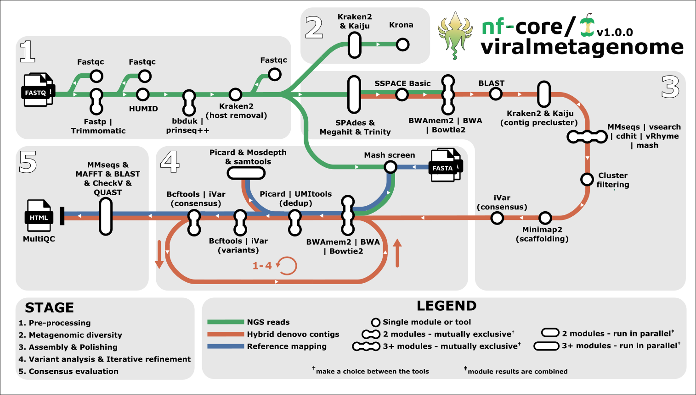

<h1>
  <picture>
    <source media="(prefers-color-scheme: dark)" srcset="docs/images/nf-core-viralmetagenome_logo_custom_dark.png">
    
  </picture>
</h1>

[](https://github.com/codespaces/new/nf-core/viralmetagenome)
[](https://github.com/nf-core/viralmetagenome/actions/workflows/nf-test.yml)
[](https://github.com/nf-core/viralmetagenome/actions/workflows/linting.yml)[](https://nf-co.re/viralmetagenome/results)[](https://doi.org/10.5281/zenodo.XXXXXXX)
[](https://www.nf-test.com)

[](https://www.nextflow.io/)
[](https://github.com/nf-core/tools/releases/tag/3.4.1)
[](https://docs.conda.io/en/latest/)
[](https://www.docker.com/)
[](https://sylabs.io/docs/)
[](https://cloud.seqera.io/launch?pipeline=https://github.com/nf-core/viralmetagenome)

[](https://nfcore.slack.com/channels/viralmetagenome)[](https://bsky.app/profile/nf-co.re)[](https://mstdn.science/@nf_core)[](https://www.youtube.com/c/nf-core)

## Introduction

**nf-core/viralmetagenome** is a bioinformatics best-practice analysis pipeline for reconstructing consensus genomes and to identify intra-host variants from metagenomic sequencing data or enriched based sequencing data like hybrid capture.



> [!NOTE]
>
> - `|` indicates the need to choose a tool
> - `&` indicate that output of tools can be combined and run in parallel.

1. Read QC ([`FastQC`](https://www.bioinformatics.babraham.ac.uk/projects/fastqc/))
2. Performs optional read pre-processing
   - Adapter trimming([`fastp`](https://github.com/OpenGene/fastp), [`Trimmomatic`](https://github.com/usadellab/Trimmomatic))
   - Read UMI deduplication ([`HUMID`](https://humid.readthedocs.io/en/latest/usage.html))
   - Low complexity and quality filtering ([`bbduk`](https://archive.jgi.doe.gov/data-and-tools/software-tools/bbtools/bb-tools-user-guide/bbduk-guide/), [`prinseq++`](https://github.com/Adrian-Cantu/PRINSEQ-plus-plus))
   - Host-read removal ([`Kraken2`](https://ccb.jhu.edu/software/kraken2/))
3. Metagenomic diversity mapping ([`Kraken2`](https://ccb.jhu.edu/software/kraken2/),[`Bracken`](https://ccb.jhu.edu/software/bracken/)[`Kaiju`](https://bioinformatics-centre.github.io/kaiju/))
4. Denovo assembly ([`SPAdes`](https://ablab.github.io/spades/), [`TRINITY`](https://github.com/trinityrnaseq/trinityrnaseq), [`megahit`](https://github.com/voutcn/megahit)), combine contigs.
5. [Optional] Extend the contigs with [sspace_basic](https://github.com/nsoranzo/sspace_basic) and filter with [`prinseq++`](https://github.com/Adrian-Cantu/PRINSEQ-plus-plus)
6. [Optional] Map reads to contigs for coverage estimation ([`Bowtie2`](http://bowtie-bio.sourceforge.net/bowtie2/),[`BWA-MEM2`](https://github.com/bwa-mem2/bwa-mem2))
7. Contig reference identification ([`blastn`](https://blast.ncbi.nlm.nih.gov/Blast.cgi?PAGE_TYPE=BlastSearch)), the top 5 hits for every contig are considered for scaffolding
8. [Optional] Precluster contigs on taxonomy classification with [`Kraken2`](https://ccb.jhu.edu/software/kraken2/) and/or [`Kaiju`](https://bioinformatics-centre.github.io/kaiju/)
9. Cluster contigs (or every taxonomic bin) with any of the following tools: [`CD-HIT-EST`](https://sites.google.com/view/cd-hit), [`vsearch`](https://github.com/torognes/vsearch/wiki/Clustering), [`mmseqs-linclust`](https://github.com/soedinglab/MMseqs2/wiki#linear-time-clustering-using-mmseqs-linclust), [`mmseqs-cluster`](https://github.com/soedinglab/MMseqs2/wiki#cascaded-clustering), [`vRhyme`](https://github.com/AnantharamanLab/vRhyme) or [`Mash`](https://github.com/marbl/Mash)
10. [Optional] Remove clusters with low read coverage. `bin/extract_clusters.py`
11. Scaffolding of contigs to centroid ([`Minimap2`](https://github.com/lh3/minimap2), [`iVar-consensus`](https://andersen-lab.github.io/ivar/html/manualpage.html))
12. [Optional] Select best reference from `--mapping_constraints`: ([`Mash sketch`](https://github.com/marbl/Mash), [`Mash screen`](https://github.com/marbl/Mash))
13. Mapping filtered reads to supercontig and mapping constraints ([`Bowtie2`](http://bowtie-bio.sourceforge.net/bowtie2/),[`BWA-MEM2`](https://github.com/bwa-mem2/bwa-mem2))
14. [Optional] Deduplicate reads ([`Picard`](https://broadinstitute.github.io/picard/) or if UMI's are used [`UMI-tools`](https://umi-tools.readthedocs.io/en/latest/QUICK_START.html))
15. [Optional] Determine various mapping statistics ([`Picard`](https://broadinstitute.github.io/picard/), [`mosdepth`](https://github.com/brentp/mosdepth), and [`samtools`](https://www.htslib.org/doc/samtools.html))
16. Variant calling and filtering ([`BCFtools`](http://samtools.github.io/bcftools/bcftools.html),[`iVar`](https://andersen-lab.github.io/ivar/html/manualpage.html))
17. Create consensus genome ([`BCFtools`](http://samtools.github.io/bcftools/bcftools.html),[`iVar`](https://andersen-lab.github.io/ivar/html/manualpage.html))
18. Iterative refinement, repeat step 13-17 multiple times for the denovo contig route
19. [Optional] Variant annotation ([`SnpEff`](https://pcingola.github.io/SnpEff/),[`SnpSift`](https://pcingola.github.io/SnpEff/SnpSift.html))
20. [Optional] Consensus evaluation and annotation with multiple tools([`QUAST`](http://quast.sourceforge.net/quast), [`CheckV`](https://bitbucket.org/berkeleylab/checkv/src/master/), [`blastn`](https://blast.ncbi.nlm.nih.gov/Blast.cgi), [`prokka`](http://github.com/tseemann/prokka), [`mmseqs-search`](https://github.com/soedinglab/MMseqs2/wiki#batch-sequence-searching-using-mmseqs-search), [`MAFFT` - alignment of contigs vs iterations & consensus](https://mafft.cbrc.jp/alignment/software/)).
21. Result summary visualisation for raw read, alignment, assembly, variant calling and consensus calling results ([`MultiQC`](https://docs.seqera.io/multiqc))

## Usage

> [!NOTE]
> If you are new to Nextflow and nf-core, please refer to [this page](https://nf-co.re/docs/usage/installation) on how to set-up Nextflow. Make sure to [test your setup](https://nf-co.re/docs/usage/introduction#how-to-run-a-pipeline) with `-profile test` before running the workflow on actual data.

First, prepare a samplesheet with your input data that looks as follows:

`samplesheet.csv`:

```csv
sample,fastq_1,fastq_2
sample1,AEG588A1_S1_L002_R1_001.fastq.gz,AEG588A1_S1_L002_R2_001.fastq.gz
sample2,AEG588A5_S5_L003_R1_001.fastq.gz,
sample3,AEG588A3_S3_L002_R1_001.fastq.gz,AEG588A3_S3_L002_R2_001.fastq.gz
```

Each row represents a fastq file (single-end) or a pair of fastq files (paired end).

Now, you can run the pipeline using:

```bash
nextflow run nf-core/viralmetagenome \
   -profile <docker/singularity/.../institute> \
   --input samplesheet.csv \
   --outdir <OUTDIR>
```

> [!WARNING]
> Please provide pipeline parameters via the CLI or Nextflow `-params-file` option. Custom config files including those provided by the `-c` Nextflow option can be used to provide any configuration _**except for parameters**_; see [docs](https://nf-co.re/docs/usage/getting_started/configuration#custom-configuration-files).

To see the results of an example test run with a full size dataset refer to the [results](https://nf-co.re/viralmetagenome/results) tab on the nf-core website pipeline page.
For more details about the output files and reports, please refer to the
[output documentation](https://nf-co.re/viralmetagenome/output).

## Credits

nf-core/viralmetagenome was originally written by Joon Klaps, Philippe Lemey, Liana Kafetzopoulou.

We thank the following people for their extensive assistance in the development of this pipeline:

- [`Philippe Lemey`](https://github.com/plemey)
- [`Liana Kafetzopoulou`](https://github.com/LianaKafetzopoulou)
- [`nf-core community`](https://nf-co.re/)

## Contributions and Support

If you would like to contribute to this pipeline, please see the [contributing guidelines](.github/CONTRIBUTING.md).

For further information or help, don't hesitate to get in touch on the [Slack `#viralmetagenome` channel](https://nfcore.slack.com/channels/viralmetagenome) (you can join with [this invite](https://nf-co.re/join/slack)).

## Citations

> Klaps J, Lemey P, nf-core community, Kafetzopoulou LE. nf-core/viralmetagenome: A Novel Pipeline for Untargeted Viral Genome Reconstruction bioRxiv 2025.06.27.661954; doi:10.1101/2025.06.27.661954

An extensive list of references for the tools used by the pipeline can be found in the [`CITATIONS.md`](CITATIONS.md) file.

<!-- You can cite the `nf-core` publication as follows: -->

> **The nf-core framework for community-curated bioinformatics pipelines.**
>
> Philip Ewels, Alexander Peltzer, Sven Fillinger, Harshil Patel, Johannes Alneberg, Andreas Wilm, Maxime Ulysse Garcia, Paolo Di Tommaso & Sven Nahnsen.
>
> _Nat Biotechnol._ 2020 Feb 13. doi: [10.1038/s41587-020-0439-x](https://dx.doi.org/10.1038/s41587-020-0439-x).
